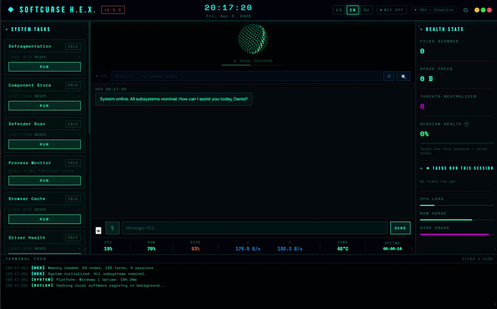
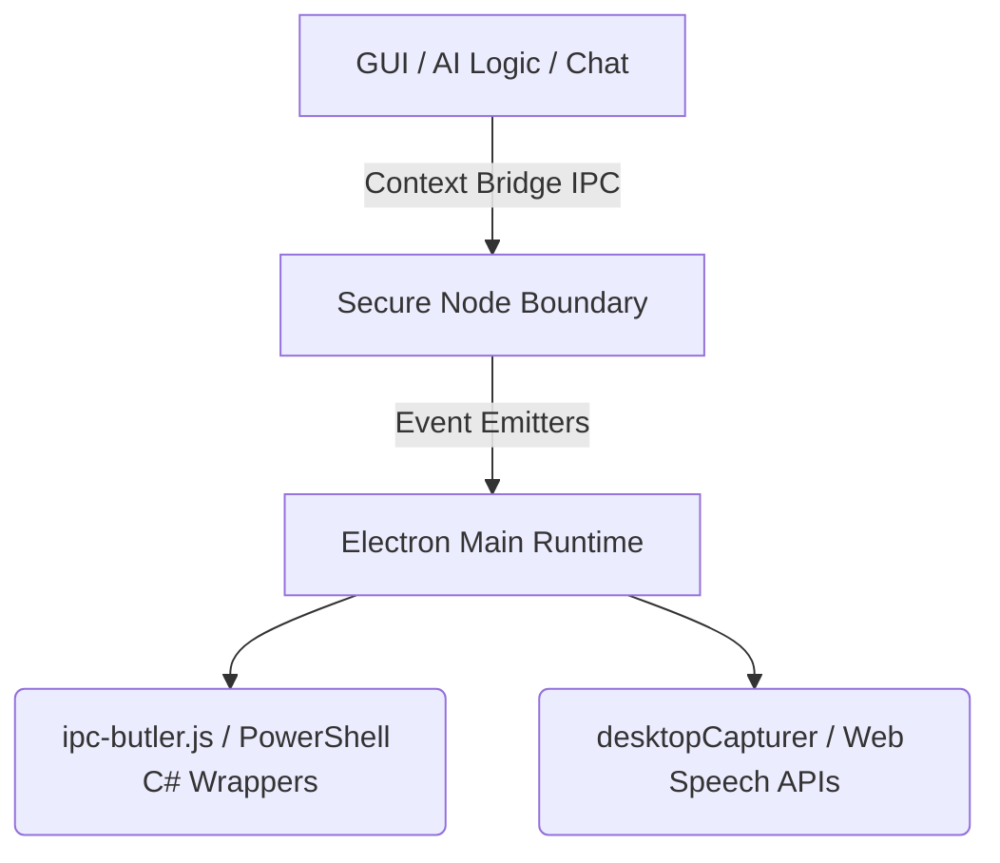

<div align="center">
  

  # Softcurse H.E.X.

  [](#)
  [](#)
  [](#)
  [](https://softcurse-website.pages.dev/)
  [](#)

  > 🚀 A high-performance desktop intelligence that pairs deep native OS control with multimodal LLM cognition.
</div>

## Table of Contents
- [Overview](#overview)
- [✨ Features](#-features)
- [📦 Installation](#-installation)
- [🚀 Quick Start](#-quick-start)
- [📖 Documentation](#-documentation)
- [🔧 Configuration](#-configuration)
- [💡 Advanced Usage](#-advanced-usage)
- [🏗️ Architecture](#️-architecture)
- [🧪 Testing](#-testing)
- [🤝 Contributing](#-contributing)
- [�️ Roadmap](#️-roadmap)
- [�📄 License](#-license)
- [👥 Acknowledgements](#-acknowledgements)
- [💬 Support](#-support)

## Overview
**Softcurse H.E.X. (Heuristic Experience eXecutive)** is a fully autonomous desktop agent engineered in Electron. Capable of viewing your screen, executing direct PowerShell hardware interrupts, scheduling background jobs, mapping local registry edits, and engaging in multi-lingual conversation via offline STT models. 

It exists to bridge the gap between AI chat wrappers and true operating system agency, designed primarily for power users and developers seeking an interactive cybernetic terminal assistant.

## ✨ Features
- 🖥️ **Total OS Master Suite:** Executes native PowerShell commands seamlessly. Read/write to the Registry, install software via `winget`, terminate PIDs, empty caches, schedule native Windows tasks, and deploy sweeps using natural language.
- 👁️ **Computer Vision Optics:** Features asynchronous hardware frame-grabbing via Electron's `desktopCapturer`. H.E.X. can "look" at your screen and natively feed visual payloads into the Gemini Vision API.
- 🎙️ **Hardware-Level Voice (STT):** Integrates isolated Native C++ Speech-to-Text inference models locally via `sherpa-onnx` for offline phonetic parsing, with zero-latency.
- 📂 **Global Omni-Launcher:** Dynamically indexes `/Start Menu` and `/Desktop` `.lnk` paths for fuzzy matching application launches.
- 🧠 **Multi-Provider Nexus:** Plugs natively into Ollama (Local), Google Gemini, OpenAI, Anthropic, Grok, Mistral, and OpenRouter architectures.
- 🛡️ **OODA Cognitive Architecture:** Enforces a 5-phase reasoning loop completely nullifying command-injection hallucinations, linked tightly with self-healing Action Outcome Telemetry.
- ⚙️ **Anti-Quota Resiliency:** Employs dynamic self-healing network routers holding steady during API rate constraints (e.g., auto-downgrading throttled endpoints smoothly).

## 📦 Installation
### Prerequisites
- **Node.js** v18+ (v24 recommended)
- **C++ Build Tools** (For compiling `sherpa-onnx` native dependencies)

### Setup
```bash
git clone https://github.com/Softcurse-Lab/softcurse-hex.git
cd softcurse-hex
npm install
```
*Note: The `postinstall` script inside `package.json` automatically triggers `electron-builder install-app-deps` to recompile the native dependencies against your specific Electron headers.*

## 🚀 Quick Start
To launch the application into your development environment immediately:
```bash
npm start
```

## 📖 Documentation
Because Softcurse H.E.X. operates intuitively through conversation, this README serves as the primary technical documentation. For full internal module specifications, review the source files located inside `src/js/`. 

## 🔧 Configuration
Configuration is securely retained locally in your OS `%APPDATA%` directory within a serialized `settings.json` file. 
You can interact with the configuration natively by using the UI settings panel (`Ctrl + ,`). 
- **LLM Settings:** Base URL overrides, API Keys, and Custom System Prompts.
- **Microphone Parameters:** Silence timeouts, volume thresholds.
- **Personality Overrides:** Agent naming or voice tone parameters.

## 💡 Advanced Usage
### The Optics Subsystem (`[ACTION:capture_screen]`)
If you ask the agent *"What is on my screen right now?"* or click the **EYE** icon, Chromium scrapes the monitor framebuffer, executes base64 binary encoding, and injects it synchronously into the multimodal message stack in order to solve coding bugs visible on your desktop.

### Native SendKeys Actions
H.E.X employs a dynamic C# compilation bridge (`Add-Type`) escaping over PowerShell to simulate pure hardware keyboard inputs. Ask it to *"Type 'hello world' on my keyboard"* and the pipeline dynamically scrubs parameters for hallucinated curly braces before invoking `[System.Windows.Forms.SendKeys]::SendWait()`.

## 🏗️ Architecture


## 🧪 Testing
Because H.E.X. relies on highly privileged, platform-specific OS logic (such as Registry manipulation and UAC bypass), we rely primarily on manual sandbox staging rather than automated headless DOM testing. 

To safely sandbox the LLM logic, you can toggle `SAFE_EXECUTION` bounds inside `main.js` to prompt UI dialogs before destructive sweeps.

## 🤝 Contributing
We welcome OS action hook extensions or localization scripts! Before submitting, please review our [Contributing Guidelines](CONTRIBUTING.md) and our [Code of Conduct](CODE_OF_CONDUCT.md).

1. Fork the Project.
2. Branch your Feature (`git checkout -b feature/NewIPCAction`).
3. Commit your Changes (`git commit -m 'Added registry sweeping'`).
4. Push to the Branch (`git push origin feature/NewIPCAction`).
5. Open a Pull Request.

## 🛣️ Roadmap
- macOS & Linux parity for all PC Butler automation actions (currently Windows-centric).
- Deeper Docker telemetry insights.
- Fully migrating to Local LLM bindings via node-llama-cpp for absolute standalone offline memory handling.

## 📄 License
Distributed under the **MIT License**. See `LICENSE` for more information.

## 👥 Acknowledgements
- Built by [**Softcurse Studios**](https://softcurse-website.pages.dev/).
- Uses [Sherpa-ONNX](https://github.com/k2-fsa/sherpa-onnx) for robust local Speech-to-Text pipelines.

## 💬 Support
- **Bugs & Features**: For general issues or feature requests, please use our strictly-formatted [GitHub Issue Templates](.github/ISSUE_TEMPLATE/). Ensure you attach Electron console trace dumps if the issue relates to Native Module compilation (`@electron/rebuild`).
- **Security Vulnerabilities**: Given H.E.X.'s extensive OS privilege hooks, do not report exploitable bugs publicly. Please refer to our [Security Policy](SECURITY.md) for private disclosure instructions.
