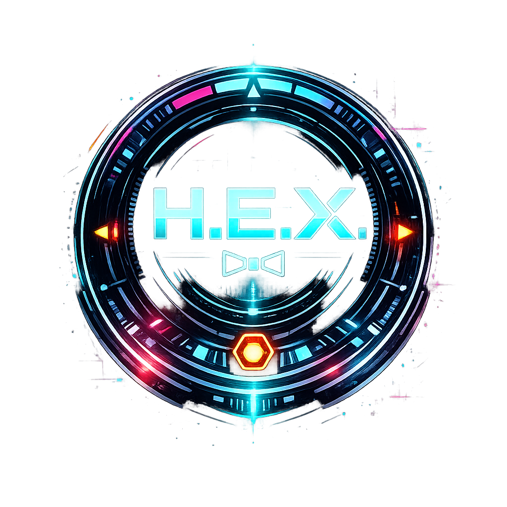

<div align="center">
  
  <br /><br />
  <h1 align="center">Softcurse H.E.X.</h1>
  <p align="center">
    <strong>Autonomous Desktop Intelligence · Compiled by Softcurse Lab</strong>
  </p>
  <p align="center">
    
    <a href="https://github.com/Beardicuss/Softcurse-HEX/blob/main/LICENSE"></a>
    
    
  </p>
  <br />
  
  <br />
</div>

---

## 📑 Table of Contents
- [What Is H.E.X.](#-what-is-hex)
- [Core Systems](#-core-systems)
- [Deployment](#-deployment)
- [Ignition](#-ignition)
- [Configuration Vault](#-configuration-vault)
- [Architecture](#-architecture)
- [Roadmap](#-roadmap)
- [Contributing](#-contributing)
- [License](#-license)
- [Support](#-support)

---

## � What Is H.E.X.

**H.E.X.** (Heuristic Execution Matrix) is a fully autonomous desktop intelligence system built from the ground up inside **Softcurse Lab**. It is not a chatbot. It is not a wrapper around someone else's API. It is a self-contained synthetic agent that fuses directly into your operating system — reading your hardware, controlling your processes, managing your files, and executing complex multi-step operations on command.

The interface is built on the **SOFTCURSE/SYS v3.0 OMEGA** design doctrine: void-black panels, rigid geometric structures, tactical corner brackets, zero border-radius, and a strict 4-color military palette. Every pixel is deliberate. Every animation is functional. There is no decoration — only information density.

H.E.X. runs **local-first**. Your data never leaves your machine unless you explicitly route it through an external API provider. The default intelligence core is powered by **Ollama**, with an automatic multi-provider fallback queue (Gemini → Groq → OpenRouter) for when you need cloud-grade reasoning without sacrificing privacy on simple tasks.

**This is not an assistant. This is infrastructure.**

---

## ⚡ Core Systems

### 🧠 Intelligence Engine
- **Local-First AI** via Ollama with custom model support (GGUF fine-tunes)
- **Multi-Provider Fallback** — automatic failover across 7 API providers (Gemini, Groq, OpenRouter, Grok, Mistral, Cohere, TogetherAI)
- **5-Phase Cognitive Loop** — every response passes through Observe → Orient → Decide → Execute → Self-Review before reaching the user
- **Anti-Hallucination Protocol** — hard-coded refusal to guess PC-specific data; forces action verification instead

### 🧬 Persistent Memory
- **Neural-Graph Vault** — long-term fact storage that survives across sessions and restarts
- **Automatic Fact Extraction** — preferences, names, URLs, and habits are indexed without manual input
- **Active Learning Engine** — say *"Hex learn [topic]"* and the system will study, parse, and permanently retain structured knowledge nodes
- **JSONL Fine-Tune Export** — every learned fact generates training pairs compatible with OpenAI, Mistral, and Unsloth pipelines

### 🎙️ Voice & Vision
- **Neural TTS** — Piper-based speech synthesis for real-time vocal output
- **Local STT** — Sherpa-ONNX / Whisper transcription for hands-free voice commands
- **Screen Capture Vision** — grab the active screen and feed it to multimodal models for visual analysis

### 🔒 Security
- **Bio-Metric Face Auth** — webcam-based identity verification to lock and unlock the terminal
- **API Key Vault** — encrypted local storage for all provider credentials

### 🔌 Plugin Architecture
- **Hot-Loadable Plugins** — drop a folder into `/plugins` and H.E.X. auto-registers new action tags
- **70+ Built-In Actions** — file management, app launching, process control, network diagnostics, clipboard ops, git commands, Docker status, scheduled tasks, and more

### 🎛️ Personality Matrix
Five built-in behavioral modes, switchable at runtime:

| Mode | Behavior |
|---|---|
| **Default** | Rebellious wit · cyberpunk edge · balanced precision |
| **Mentor** | Deep explanations · guiding questions · patient teaching |
| **Professional** | Zero filler · structured output · cold efficiency |
| **Minimal** | Fact-only · 2-3 sentences max · social interaction disabled |
| **Creative** | Lateral thinking · vivid metaphors · brainstorming focus |

Custom personalities can be created, saved, and loaded from the Settings panel.

### 🔊 Tactical Audio Layer
- `processing.wav` — loops during AI inference, drops on response
- `network_reroute.wav` — fires during automatic provider failover
- `threat_detect.wav` — triggers when system integrity drops below 80%
- `mic_on.wav` — pops on microphone activation
- `toast_notify.wav` — wired into the popup alert system
- `action_exec.wav` / `ui_hover.wav` — tactile feedback on interactions

### 🖥️ Interface
- **SOFTCURSE/SYS v3.0 OMEGA** design system — glassmorphism, CRT scanlines, film grain, tactical brackets
- **Custom Cyber Cursor** — 11-frame animated PNG overlay replacing the OS pointer globally
- **Metallic Orb Window Controls** — dark glass minimize/maximize/close buttons with cyan/red glow
- **Real-Time Vitals Strip** — CPU, RAM, disk, network, temperature updated every 5 seconds
- **25+ Systemic Animations** — glitch, radar pulse, holographic shimmer, chromatic aberration

---

## 📦 Deployment

Requires **Node.js v18+** and **npm**.

```bash
# Clone the repository
git clone https://github.com/Beardicuss/Softcurse-HEX.git

# Enter the sector
cd Softcurse-HEX

# Install dependencies
npm install
```

For local AI, install [Ollama](https://ollama.ai) and pull a model:
```bash
ollama pull qwen2.5:7b
```

---

## 🚀 Ignition

```bash
npm start
```

The void-black interface will initialize. The intelligence orb at the center of the screen is your direct link to HEX. Type commands into the bottom terminal input, or click the microphone to engage voice protocols. H.E.X. will identify your intent, verify data through system actions, and execute.

---

## 🔧 Configuration Vault

1. Click the **⚙** icon in the top-right corner to open the Settings overlay.
2. **AI Tab** — Select your provider, paste API keys, choose models, adjust temperature.
3. **Voice Tab** — Configure TTS engine, STT sensitivity, voice output toggle.
4. **Persona Tab** — Switch between personality modes or create custom behavioral profiles.
5. **System Tab** — Toggle Ollama auto-start, face auth, and system monitoring intervals.

All settings persist locally between sessions. API keys are stored in an encrypted vault on disk.

---

## 🏗️ Architecture

```
┌─────────────────────────────────────────────────┐
│                  ELECTRON SHELL                  │
│  main.js · preload.js · IPC Bridge              │
├─────────────────────────────────────────────────┤
│              RENDERER (Vanilla Stack)            │
│  HTML · CSS (SOFTCURSE/SYS v3.0) · JS           │
├──────────┬──────────┬──────────┬────────────────┤
│ ai.js    │ memory.js│ voice.js │ actions.js     │
│ LLM Core │ Neural   │ TTS/STT  │ 70+ System    │
│ + Prompt │ Graph    │ Pipeline │ Actions        │
│ Engine   │ Vault    │          │                │
├──────────┴──────────┴──────────┴────────────────┤
│              PLUGIN LAYER                        │
│  /plugins — hot-loadable action extensions       │
└─────────────────────────────────────────────────┘
```

| Layer | Stack |
|---|---|
| **Shell** | Electron 41.x — frameless window, IPC channels, native OS hooks |
| **Frontend** | Vanilla HTML/CSS/JS — zero framework overhead, instant startup |
| **Design** | Custom `:root` token system — Cyan, Orange, Magenta, Blue on Void Black |
| **Typography** | Orbitron (Display) · Rajdhani (Tactical) · JetBrains Mono (Data) · Chakra Petch (Body) |
| **Intelligence** | Ollama (local) + 7 cloud providers via priority-sorted fallback queue |

---

## 🛣️ Roadmap

- [x] Multi-provider API fallback with priority queue
- [x] Persistent neural-graph memory system
- [x] Active learning engine with JSONL fine-tune export
- [x] Tactical audio feedback layer (7 sound events)
- [x] Custom cyber cursor overlay (11-frame animation)
- [x] Metallic orb window controls
- [ ] Multi-monitor HUD widget detachment
- [ ] Real-time GPU telemetry integration
- [ ] Autonomous task scheduling via natural language
- [ ] Plugin marketplace and community registry

---

## 🤝 Contributing

We accept structural engineers and code tacticians. Read the [Contributing Guide](.github/CONTRIBUTING.md) to understand our branch conventions, commit format, and design philosophy before submitting a pull request.

Review the [Code of Conduct](.github/CODE_OF_CONDUCT.md) before participating.

---

## � License

Licensed under the **MIT License**. See the [LICENSE](LICENSE) file for details.

You are free to use, modify, and distribute this software, provided you retain the original copyright notice.

---

## 💬 Support

If you encounter system anomalies or unexpected faults, file a report via the [GitHub Issues](https://github.com/Beardicuss/Softcurse-HEX/issues) tracker.

<div align="center">
  <br />
  <strong>Compiled by Softcurse Lab · Engineered by Dante</strong>
  <br />
  <em>Shape your desktop. Rule the grid.</em>
  <br /><br />
</div>
